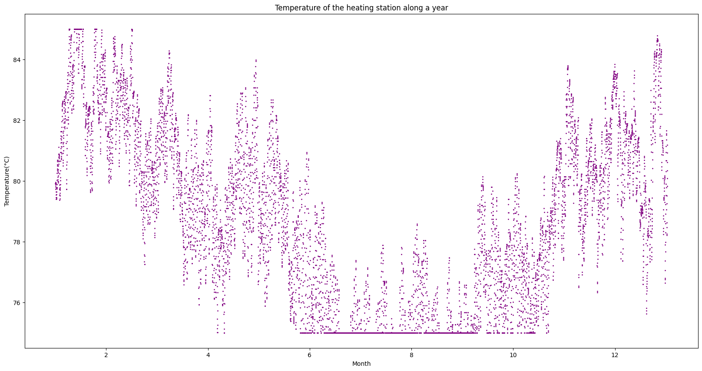
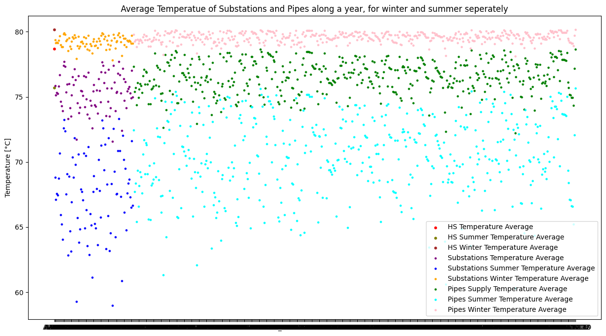
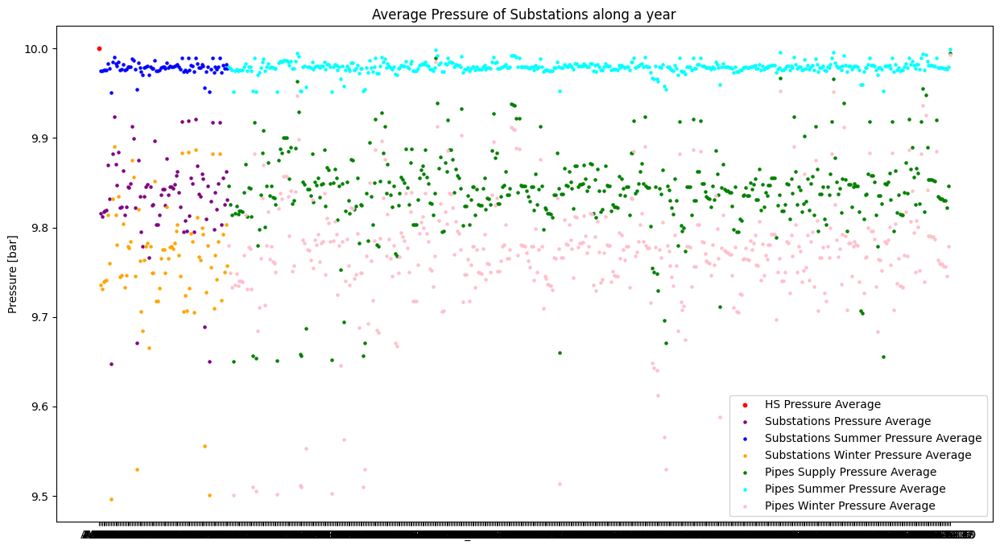
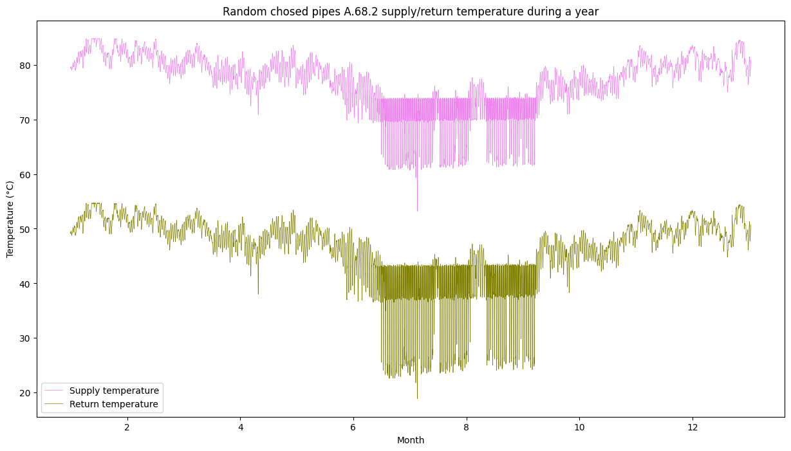
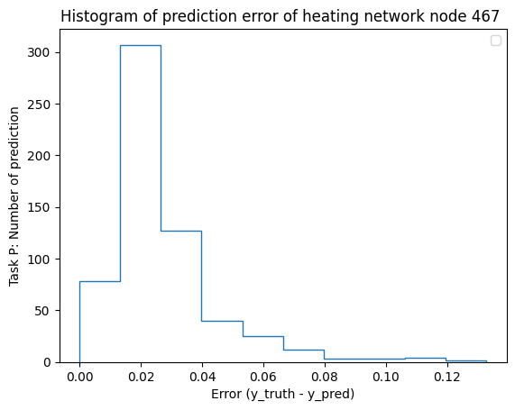
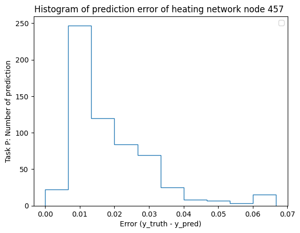
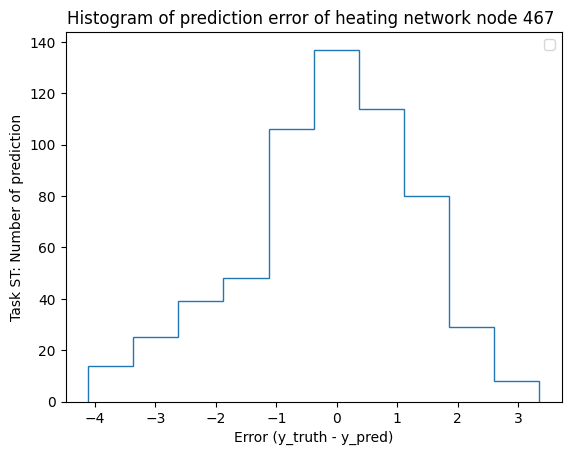
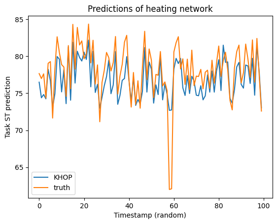

# DHN-simulation
Build for semester project - District heating network simulation.

## Table of Contents
- [Introduction](#introduction)
- [Analysis](#analysis)
- [Methodology](#methodology)
- [Experiment Results](#experiment-results)
- [Discussion](#discussion)
- [Running the Code](#running-the-code)
- [Citation](#citation)

## Introduction
District heating involves the distribution of heat from a centralized source like a power plant or waste incinerator to various buildings for heating and hot water needs [1]. This system is particularly energy-efficient, cost-effective, and eco-friendly for urban regions in colder climates [2]. Accurate forecasting of district heat load, which is the required heat supply at a specific time [3], is crucial for the efficient operation and planning of these systems. However, forecasting is complex due to the heat demand's non-linear and non-stationary characteristics.

Forecasting district heat load is a complex task that involves predicting future heat demand by analyzing historical data and various influencing factors like weather conditions and infrastructure characteristics. The challenge lies in the non-linear and non-stationary nature of heat demand, compounded by numerous influencing factors, which complicates accurate forecasting [4]. In response, researchers are increasingly turning to advanced machine learning (ML) methods, especially deep learning, due to their capacity for discerning intricate patterns and dependencies within data [5]. Within this realm, active deep learning emerges as a particularly effective technique. It enables the model to selectively target the most informative data points, thereby enhancing forecast accuracy and reducing the effort and expense of data collection. This method is especially suitable for district heat load simulation, given the often highly variable and intricate nature of the data involved [5].

## Analysis
### Basic knowledge of District Heating Network
**Components:**
- Station (HS): This facility supplies hot water to the network, distributing it through pipes to substations.
- Substations: These are the terminal points of the network, where the heat demand is actualized.
- Pipes: These form the connecting infrastructure of the network.

**Physical parameters:**
1. Temperature (°C)
2. Pressure (bar)
3. Mass flow ($m^3/s$)

**Physical relationship and formula:**
Darcy–Weisbach equation

$$
\frac{\Delta p}{L} = f_D \cdot \frac{\rho}{2} \cdot \frac{\langle v \rangle^2}{D_H}
$$

In the field of fluid dynamics, the Darcy-Weisbach equation is an empirical formula that establishes a relationship between the loss of head or pressure loss and the average velocity of fluid flow along a specific pipe length, specifically for incompressible fluids[6]. This formula facilitates the establishment of a connection between pressure loss and mass flow. In the context of this case study, it becomes feasible to primarily focus on predicting temperature and pressure, while deriving the mass flow values indirectly using the Darcy-Weisbach equation.

**Node Representation Approach:**
In this study, a node representation framework is adopted. This means all network components, including the Heating Station, substations, and pipes, are conceptualized as nodes rather than edges. Each node is characterized by three primary attributes: temperature, pressure, and mass flow. This node-centric approach facilitates the implementation of graph neural networks. Additionally, given that the structural configuration of the District Heating Network remains constant, this representation ensures a stable graph structure. It allows for model training focused on varying node attributes while maintaining an unchanged graph structure.

**Known and Predictive Attributes:**
- At the Heating Station: The temperature attribute is known.
- At the Substations: The pressure attribute is known.
- Other Attributes: The remaining attributes, including those at various nodes and interconnecting pipes, are subject to prediction through the model.

### Structural Analysis of the Heating Network
The heating network is designed with a central heating station that feeds into 89 substations through an intricate piping system. This system employs two principal strategies for connectivity: a tree structure and a looped structure, with both designs achieving a state of full network integration.

1. The tree configuration is characterized by a radial pattern, where each substation is connected to a single path leading back to the heating station, thereby eliminating any possibility of loop formations.
<figure>
  
  <figcaption style="text-align: center;">The tree structure network</figcaption>
</figure>

2. The looped configuration introduces a singular loop within the network, contributing to a more complex distribution of the thermal and hydraulic parameters. This loop facilitates multiple pathways for the flow, which can lead to variations in temperature, pressure, and mass flow rates, requiring more sophisticated models for accurate prediction and control of the system's behavior. The presence of a loop can enhance system resilience and provide alternative routes for heat distribution, potentially improving system redundancy and operational flexibility. However, it also adds complexity to the management of flow dynamics, necessitating advanced analysis to ensure efficient operation.
<figure>
  
  <figcaption style="text-align: center;">The looped structure network</figcaption>
</figure>

3. The supply and return network: the supply network, which distributes heat to the substations, and the return network, which carries the cooled fluid back to the heating station, are nearly mirror images in terms of their structure and function. Given this symmetry, the study leverages a single graph-based representation for both networks. By duplicating the features—such as temperature, pressure, and mass flow—of each node in the supply network to its corresponding node in the return network, the model efficiently captures the dynamics of the entire system within a unified framework. This approach simplifies the modeling process without sacrificing the accuracy of the system's representation, as it assumes that the conditions affecting both the supply and return flows are comparable and can be analyzed using the same set of parameters.

### Analysis of the yearly data
<figure>
  
<!--   <figcaption>The looped structure network</figcaption> -->
</figure>
1.The graphical analysis clearly delineates distinct demand patterns that facilitate the categorization of the data into two seasonal sets: summer and winter. The summer data set encompasses the period from June to October, reflecting specific demand characteristics of this season. Conversely, the winter data set comprises the remaining months, capturing a different demand profile. 
The observed variations in the average temperature and pressure, as illustrated in the above plots, further substantiate the marked seasonal distinctions in heating supply demands between summer and winter.

  <figure>
    
    <!-- <figcaption>Temperature for all nodes through a year</figcaption> -->
  </figure>
  <figure>
    
    <!-- <figcaption>Pressure for all nodes through a year</figcaption> -->
  </figure>

2. A consistent temperature differential of approximately 30 °C is observed between the supply and return flows across all pipes and substations. To exemplify this, a temperature profile of a randomly selected pipe has been plotted over an annual cycle. This plot serves to visually represent the temperature disparity between the supply and return networks throughout the year.
<figure>
  
<!--   <figcaption>Return/Supply Temperature of a random selected pipe node through a year</figcaption> -->
</figure>

## Methodology
### Enhanced K-hop Information Aggregation via Shortest Path Analysis in Graph Networks
The methodology for identifying the shortest paths within a graph structure draws inspiration from established algorithms within the domain of graph theory [7]. In the current research, we extend beyond the conventional paradigm of aggregating information solely from the immediate neighbors. We propose an advanced k-hop information gathering technique that systematically captures node attributes connected by the shortest path within a predefined maximal distance. This approach enables the assimilation of a richer informational context over a specified number of network layers.

The enrichment of the information set is achieved by utilizing the k-hop reachability within the network. This technique ensures that for each node, the feature set is not just a function of its adjacent nodes but also includes the attributes of nodes that, although not directly connected, play a significant role in the network's topology by virtue of being within the optimal path framework. By harnessing this expanded k-hop strategy, the proposed model is capable of integrating a more comprehensive representation of the network's structure, thereby enhancing the predictive performance and the accuracy of the subsequent analysis. 

The integration of information over these optimal paths is particularly pertinent in applications where the relational context of the nodes—defined by their shortest path connections—bears substantial influence on the network's functional characteristics. This refined approach to information gathering is anticipated to yield substantial improvements in tasks that are sensitive to the broader structural and relational nuances of the graph.

### Design of the neural network
In this case study, the node regression ct_KHOP model consists of several key components:

1. Initial Multilayer Perceptron (MLP): This component is a sequential model starting with a linear transformation that expands the input features from 2 to 64 dimensions, followed by batch normalization, a non-linear ReLU activation, another linear transformation, and a subsequent batch normalization with ReLU activation.

2. Regression Transformation MLP: A second sequential block is designed with a similar structure to the initial MLP but narrows the feature space from 64 to 1 dimension. This transformation is presumably aimed at regressing the learned embeddings to a single output value, following the non-linear activation and batch normalization steps.

3. Initial and Final Linear Layers: Two separate linear transformations are included, each mapping the 64-dimensional feature space to a single dimension. These layers likely serve as connectors or adapters to the sequential blocks or as additional transformation steps for the features.

4. GCN_SP Modules: The core of the ct_KHOP model lies in its ModuleList of GCN_SP_Layer instances. Each GCN_SP_Layer includes an MLP similar to the initial one, ensuring a consistent transformation of features within the graph convolutional layers. The GCN (Graph Convolutional Network) layer itself is a pivotal part of the model, designed to process graph-structured data by considering node features and the graph topology.

5. Linear Modules: The model includes a ModuleList of linear transformations, each taking a 64-dimensional input to a single-dimensional output. These modules might be used to process node-level features individually or in concert with the GCN layers.

6. Layer Normalization: The model employs layer normalization modules to stabilize the learning process. Each LayerNorm module is configured to normalize a 64-dimensional input feature vector, which could be essential for maintaining training stability across deeper network layers.

The ct_KHOP GNN model is designed to be a sophisticated network designed for regressing graph-structured data. It incorporates multiple processing layers, including MLPs for feature embedding, GCN layers for capturing the graph topology's influence on node features, and linear layers for feature transformation. The model emphasizes normalization and non-linear activation to manage feature distribution and introduce non-linearity, essential for capturing complex patterns within the data. This architecture suggests a focus on learning robust node representations that are subsequently regressed to a target output.

## Experiment Results
### Accuracy
After a training process of 200 epochs for pressure and 400 epochs for supply temperature, the graphical representations provided clearly indicate a notable degree of precision in the model predictions for both pressure and supply temperature within the network. Specifically, the Mean Absolute Percentage Error (MAPE) for pressure predictions registers below 0.5%, while the supply temperature predictions maintain a MAPE around 1%. Additionally, the Root Mean Square Error (RMSE) values are quantified as 0.05 bar for pressure and 1.5 °C for supply temperature.

It is noteworthy that the central region of the network demonstrates a heightened level of predictive accuracy. This observation suggests that the model's performance is particularly robust in this area, potentially due to more stable and consistent operational conditions or denser data availability, which allows for more accurate modeling and analysis of the system's behavior.

| Pressure         | MAPE  | RMSE(bar) |
|------------------|-------|-----------|
| Loop          | 0.21%  | 0.031  |
| Tree          | 0.24%  | 0.036  |

<figure>
  
  <figcaption style="text-align: center;">Error of Pressure Pridiction in the loop network</figcaption>
</figure>
<figure>
  
  <figcaption style="text-align: center;">Error of Pressure Pridiction in the tree network</figcaption>
</figure>

| Temperature      | MAPE  | RMSE(K) |
|------------------|-------|---------|
| Loop             | 1.46%  | 1.50  |
| Tree             | 1.69%  | 1.68  |

<figure>
  
  <figcaption style="text-align: center;">Error of Supply Temperature Prediction in the loop network</figcaption>
</figure>
<figure>
  
  <figcaption style="text-align: center;">Error of Supply Temperature Prediction in the tree network</figcaption>
</figure>

  <figure>
    
    <!-- <figcaption>Histogram of Pressure Prediction of a randomly selected node</figcaption> -->
  </figure>
  <figure>
    
    <!-- <figcaption>Supply Temperature Prediction of a randomly selected node</figcaption> -->
  </figure>

  <figure>
    
    <!-- <figcaption>Pressure Prediction of a randomly selected node</figcaption> -->
  </figure>
  <figure>
    
    <!-- <figcaption>Supply Temperature Prediction of a randomly selected node</figcaption> -->
  </figure>

The provided plots depict the simulation results for the supply temperature at 100 distinct time points throughout the year. The plot on the left illustrates the simulation outcomes for a tree network configuration, while the plot on the right represents the simulation for a loop network structure.

## Running the Code
To run the code provided in Colab Notebook, make sure to add the [data] folder to Google drive under path [/content/drive/My Drive/] first. The [data] directory is in link: https://drive.google.com/drive/folders/1xx12tLFajrRgSRFmo05LQ7-vveLED9Rp?usp=drive_link

And follow the order of cells to run the Colab Notebook.

## Citation
[1]Werner, S. (2017). International review of district heating and cooling. Energy, 137, 617-631. https://doi.org/10.1016/j.energy.2017.04.045  
[2]Rezaie, B., & Rosen, M. A. (2012). District heating and cooling: Review of technology and potential enhancements. Applied Energy, 93, 2-10. https://doi.org/10.1016/j.apenergy.2011.04.020  
[3]Tardioli, G., Kerrigan, R., Oates, M., O‘Donnell, J., & Finn, D. (2015). Data Driven Approaches for Prediction of Building Energy Consumption at Urban Level. Energy Procedia, 78, 3378-3383. https://doi.org/10.1016/j.egypro.2015.11.754  
[4]Gadd, H., & Werner, S. (2013). Daily heat load variations in Swedish district heating systems. Applied Energy, 106, 47-55. https://doi.org/10.1016/j.apenergy.2013.01.030  
[5]Chung, W. H., Gu, Y. H., & Yoo, S. J. (2022). District heater load forecasting based on machine learning and parallel CNN-LSTM attention. Energy, 246, 123350. https://doi.org/10.1016/j.energy.2022.123350  
[6]Darcy–Weisbach equation. (2024, January 10). In Wikipedia. https://en.wikipedia.org/wiki/Darcy%E2%80%93Weisbach_equation  
[7]Abboud, R., Dimitrov, R., & Ceylan, İ. İ. (2022). Shortest Path Networks for Graph Property Prediction. ArXiv. /abs/2206.01003  
